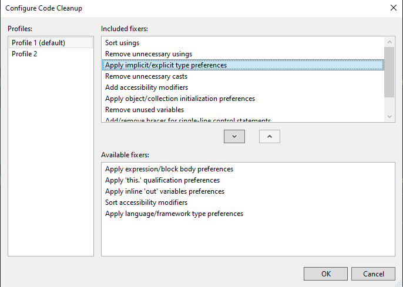

# Coding Convention
This project is about to ensure and automate some coding conventions in C# file:

 1. Invoke code cleanup profile of Visual Studio
 
 2. Organise the code structure into sections following order: 
  - Constants
  - Readonly class variables
  - Class variables
  - Constructor(s)
  - Methods
  - Properties
  - Destructor
 3. In each section, the code will sorted by access modifier following order:
  - public
  - protected internal
  - protected (or privated protected)
  - internal
  - default
  - private